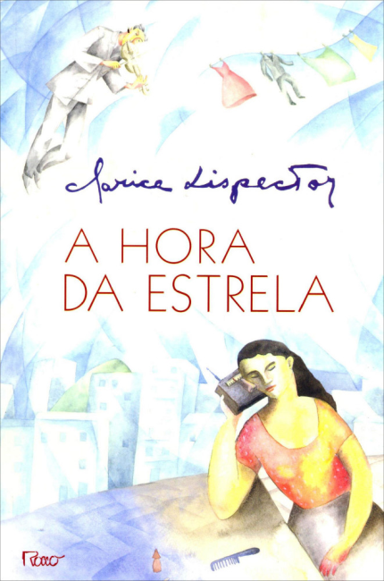

Title: A hora da estrela - parte 1
Date: 2018-02-24 10:00
Category: Literatura
Tags: Clarice Lispector
Slug: hora-da-estrela-1
Authors: Abelardo Vieira Mota
Summary: Interpretando A hora da estrela

# Ideia

Há um ano li pela primeira vez o livro **A hora da estrela**, da *Clarice Lispector* e fiquei maravilhado com o quebra-cabeça em forma de texto, tal qual no **O pequeno príncipe**. O texto parece ser a expressão superficial de um mecanismo complexo - por trás dele há uma *Clarice Lispector*; por trás dele pode se posicionar um *Abelardo*. Provavelmente há uma expressão para esse tipo de leitura, que consiste em buscar um significado oculto através do texto: este significado está tanto oculto no texto e no seu autor, mas também no leitor. A leitura consiste então em realizar uma autorreflexão guiada pelo texto. Aqui irei colocar notas das reflexões que fiz na leitura do **A hora da estrela**.

Quanto ao livro, não vou descrevê-lo. É a Macabéa, ou eu, ou você.

# Intragável

Lembro bem quando comecei a leitura do livro: esse texto foi gerado aleatoriamente? Mas acreditar que por trás dele houve um ser humano, com intenções e ideias profundas, me fez persistir. E achei fantástico encontrar nele tantos temas que me interessam, tantos padrões para explorar.

As leituras que se seguiram, 3 vezes desde então, foram sempre bem lentas, pausadas, não lineares: por vezes me peguei relendo a mesma frase várias vezes.

No mundo da ciência de dados há a ideia de que os dados lhe dirão qualquer coisa se você os torturar. Esse livro tem me dito coisas por eu tê-lo torturado, com tantas leituras? Talvez. A finalidade da leitura, como disse, não é encontrar o significado que o autor quis transmitir, mas o significado que está oculto em mim, estimulado pelos símbolos do texto.

# Observações

No decorrer da leitura identifiquei alguns temas que são recorrentes e fui marcando, com alguns desenhos, suas ocorrências no texto. Segue a lista:

* **Confusão entre as personagens**: seguindo a ideia de que todas as personagens são expressões da Clarice, esse tema se refere aos trechos onde parece haver uma confusão sobre que personagem está se expressando naquele momento.
* **Afirmação de identidade**: há diversos trechos que me trazem a ideia da necessidade de afirmar-se como indivíduo, único.
* **Frase incompleta**
* **Explosão**: há várias ocorrências da expressão *explosão* entre parênteses.
* **Vingança**
* **Galo**
* **Palavra repetida 3 vezes em sequência**
* **Chuva**
* **Dente**
* **Capim**
* **Incapacidade de expressar verdade**: há trechos que me passam essa ideia do inefável, que sempre me fazem lembrar dos contos do **H.P.Lovecraft** e a interpretação de seu universo como uma alegoria para questões psicológicas.

Sabe aquelas peças do quebra-cabeça que identificam uma posição da imagem, que montamos primeiro para então, ao redor delas, montarmos as demais? Essas são algumas das peças que achei.

# Título

A hora da estrela é apenas um dos títulos do livro: logo no início há uma lista de pequenas frases separadas por **ou**. 

Quando notei alguns dos títulos dentro do texto, comecei a anotar as páginas em que ocorriam e comecei a procurá-los, primeiro prestando atenção na leitura, depois pesquisando na versão digital do livro. Seguem, com indicação da página onde aparecem:

1. **A culpa é minha** - p.39
2. **A hora da estrela** - p.29
3. **Ela que se arranje** - p.64
4. **O direito ao grito** - p.13
5. **Quanto ao futuro** - p.13
6. **Lamento de um blue**
7. **Ela não sabe gritar**
8. **Uma sensação de perda**
9. **Assovio no vento escuro** - p.18
10. **Eu não posso fazer nada**
11. **Registro dos fatos antecedentes** - p.12
12. **História lacrimogênica de cordel** - p.33
13. **Saída discreta pela porta dos fundos** - p.21

# Até mais

A partir daqui, vou fazer uma leitura linear do texto, comentando as ideias que me vieram.